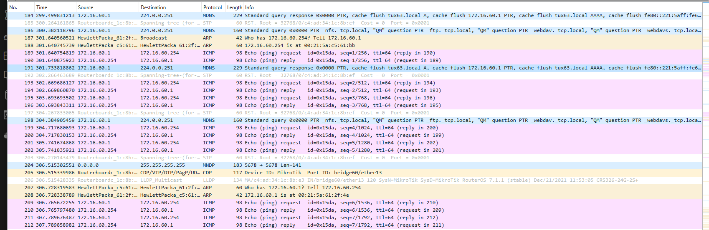

#Implement two bridges in a switch

##Steps

1.  We then reset the switch configurations with the command:
   ```bash
   systemctl restart networking
   ```
Then we connect Tux62 to the switch. In this same Tux we open GKTerm and set hte baudrate to 115200.

We then must set up this connection by running:
    ```bash
    ifconfig eth0 up
    ifconfig eth0 172.16.61.1/24
    ```

2. We then create the 2 bridges in the switch.
    ```bash
    /interface bridge add name=bridge60
    /interface bridge add name=bridge61
    ```

3. We then eliminate the default bridges and add the new ones.
   ```bash
   /interface bridge port remove [find interface=ether1] 
   /interface bridge port remove [find interface=ether2] 
   /interface bridge port remove [find interface=ether3] 
   /interface bridge port add bridge=bridge60 interface=ether1
   /interface bridge port add bridge=bridge60 interface=ether2 
   /interface bridge port add bridge=bridge61 interface=ether3
   ```

6. We then ping the other Tux in Tux63 and then we capture on Wireshark:



8. In Tux63, we now do ping -b 172.16.60.255
9. Capturing the logs we get: 


##Questions

- **How to configure bridgeY0?**
    The bridge60 was created to link up the Tux63 and Tux64 in a subnet. In order to do this, we first resetted the switch settings and then created new bridges to each of the computers with the commands seen above.

- **How many broadcast domains are there? How can you conclude it from the logs?**
    The numbers of broadcast domains is the same as number of bridges implemented, so 2. Analysing the logs, we can see that the ping from Tux63 got a reply from Tux64 and that there was no reply from Tux62. This can be explained by them being implemented in 2 different bridges.