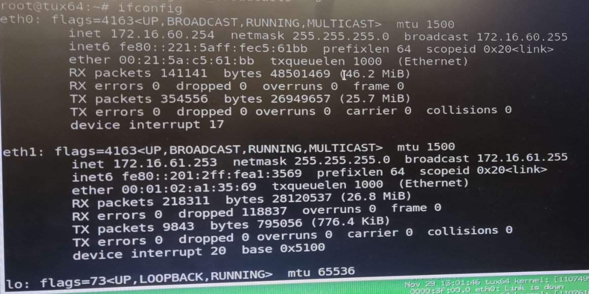
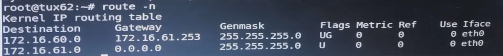
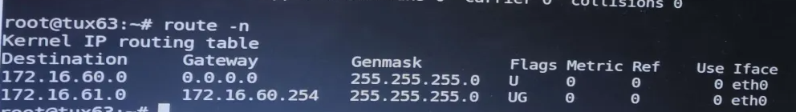
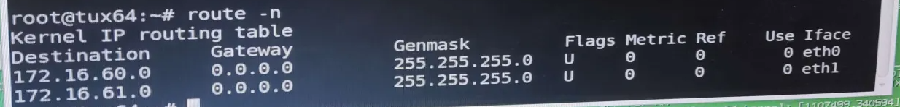
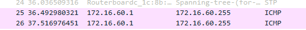

#Configure a Router in Linux

##Steps

1. We start off by connecting eth1 from the Tux64 to the port 1 from the switch. We then run:
    ```bash
    ifconfig eth1 172.16.61.253/24
    /interface bridge port add bridge=bridge61 interface=ether1
    ```

    As requested in class, we only Disable ICMP echo-ignore-broadcast:

    ```bash
    sysctl net.ipv4.icmp_echo_ignore_broadcasts=0
    ```

2. We now run *ipconfig* in Tux64:
   

    We can see that:
    - For eth0: Mac = *00:21:5a:c5:61:bb*  and IP = *172.16.60.254*
    - For eth1: Mac = *00:01:02:a1:35:69*  and IP = *172.16.61.253*
    
3. In order to make it so that Tux63 and Tux62 reach each other, we must add the following routes:
    ```bash
    route add -net  172.16.60.0/24 gw 172.16.61.253 #on Tux62
    route add -net  172.16.61.0/24 gw 172.16.60.254 #on Tux63
    ```

4. We now run *route -n* on all the computers:
   - Tux2:
    

   - Tux3:
     

    - Tux4:
    

5. We start capturing on Wireshark in the Tux63.
   
6. In Tux63, we now run:
    ```bash
    ping 172.16.60.254
    ping 172.16.61.253
    ping 172.16.61.1
    ```
    What we captured in Wireshark is in ficheiro exp3-passo7-rcom-noipforward.

    Now we are going to do the same as step 5 and 6, but we first enable ip forwarding.

    ```bash
    sysctl net.ipv4.ip_forward=1
    ```

    The results with ip forwarding are in exp3-passo7-rcom.

8. We start capturing eht0 and eth1 in Wireshark from Tux64.
   
9. To clean the ARP tables we run on each Tux:
    ```bash
    #Tux62:
    arp -d 172.16.61.253
    #Tux63:
    arp -d 172.16.60.254
    #Tux64:
    arp -d 172.16.60.1 
    arp -d 172.16.61.1
    ```

10. In Tux63, we run *ping 172.16.61.1/24*

11. The Wireshark results are in passo11-exp3-rcom-eth0 and passo11-exp3-rcom-eth1.

##Questions

- **What are the commands required to configure this experience?**
    The commands used are *ifconfig eth1 ipaddress*(to connect the network interface), */interface bridge port add* (to add a bridge port), *sysctl net.ipv4.icmp_echo_ignore_broadcasts=0* and *sysctl net.ipv4.ip_forward=1* (to disable ICMP echo-ignore-broadcast and enable IP forwarding),*ipconfig* (to see information about the network interfaces), *route -n* (to observe the routes), *ping* (to test connectivity),*route add -net* (to add routes) and *arp -d* (to delete ARP table). 

- **What routes are there in the tuxes? What are their meaning?**
    There's a route in Tux62 and another in Tux63 and both of them have Tux64 as a gateway as it is connected to both routes.

- **What information does an entry of the forwarding table contain?**
    Each entry has the IP of the destination and its gateway.

- **What ARP messages, and associated MAC addresses, are observed and why?**
    As we ping Tux62 from Tux63, the ARP messages contain the MAC of both Tux63 and Tux64 and does not include the MAC from Tux63, as with the routing implementation Tux63 does not know the address of Tux62, instead it only knows how to get to Tux62 through the getway.

- **What ICMP packets are observed and why?**
    As we're getting the ICMP packets we know that the connectivity is working well. These ICMP packets contain the IP address from the source and destination, in this case from Tux63 and Tux62 respectively.

    

- **What are the IP and MAC addresses associated to ICMP packets and why?**
    For each ICMP packet we can see that during the ping Tux63 has the source IP address and the destination IP adrdress but contain the MAC address of Tux64, as it is the "bridge" between Tux62 and Tux63.